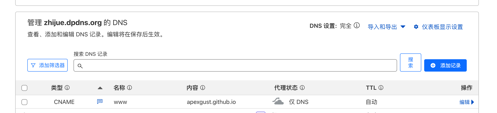
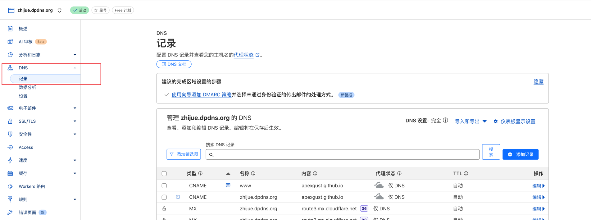
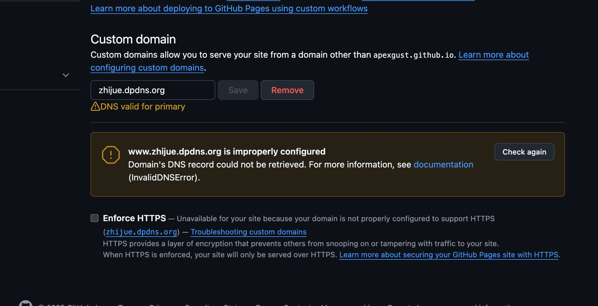
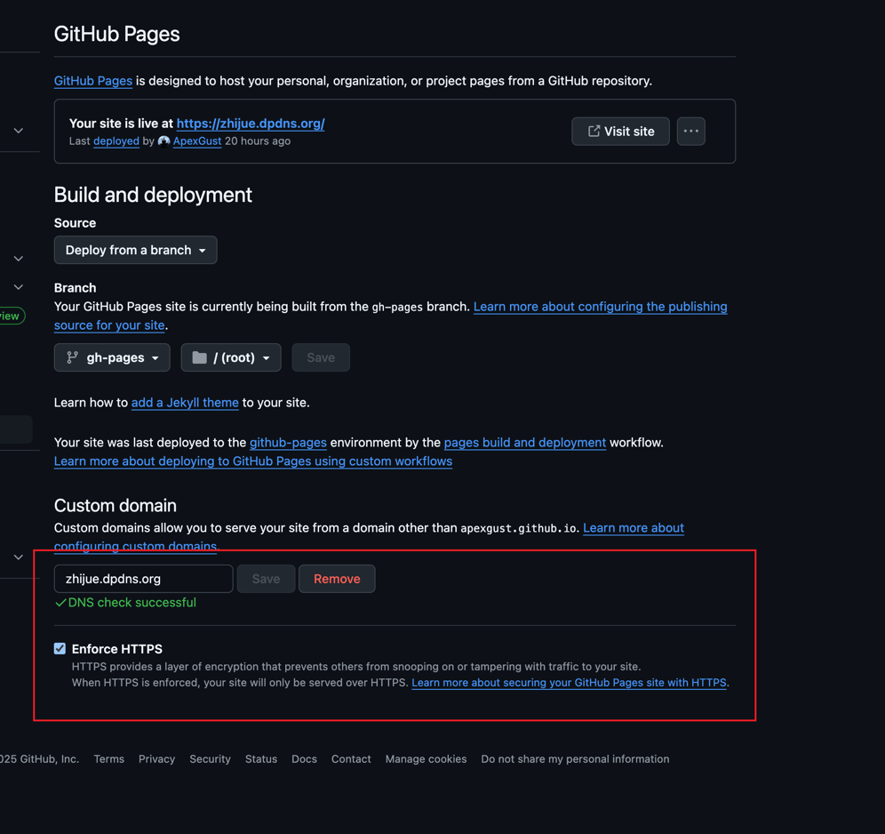

## 前言

拥有一个自定义域名并将其指向托管在 GitHub Pages 上的个人博客、项目文档或作品集，是许多开发者和内容创作者的常见需求。GitHub Pages 提供了免费、便捷的静态站点托管服务，而 Cloudflare 则以其强大的 DNS管理、安全防护和 CDN 加速功能著称。将两者结合，无疑能为我们的站点带来更专业的外观和更优越的性能。

然而，在配置过程中，尤其是涉及到 Cloudflare 的代理功能时，我们有时会遇到一些 GitHub Pages 无法正确验证 DNS 记录的小插曲。本文将详细记录一次典型的配置过程，以及如何解决 GitHub Pages 设置页面中可能出现的 DNS 警告，最终实现自定义域名与 GitHub Pages 的完美结合，并成功启用 HTTPS。

## 我的目标

我拥有一个在 Cloudflare 注册和管理的域名（假设为 `yourdomain.com`，在实际操作中，我们的例子是 `dpdns.org` 及其子域名），并且在 GitHub 上有一个 Pages 项目，可以通过 `your-github-username.github.io` 访问。我希望实现以下目标：

1.  用户通过访问 `www.yourdomain.com`（或 `yourdomain.com`）能够看到我的 GitHub Pages 站点内容。
2.  整个站点启用 HTTPS，确保数据传输安全。
3.  充分利用 Cloudflare 提供的 CDN 加速和安全特性。

## 配置步骤详解

整个配置过程主要分为两大部分：在 GitHub Pages 中设置自定义域名，以及在 Cloudflare 中配置相应的 DNS 记录。

### 步骤一：在 GitHub Pages 中声明你的自定义域名

1.  **导航至你的 GitHub Pages 仓库设置：** 打开你的 GitHub 仓库，点击 "Settings" (设置)，然后在左侧菜单中选择 "Pages"。
2.  **输入自定义域名：** 在 "Custom domain" (自定义域名) 部分，输入你希望用户用来访问你的站点的完整域名。
    *   如果你希望使用 `www` 子域名，例如 `www.yourdomain.com`，就输入它。
    *   如果你希望使用 Apex 域名（也称为根域名或裸域名），例如 `yourdomain.com`，就输入它。
    *   **我们的实践：** 我们最初尝试了 `zhijue.dpdns.org` 作为 Apex，并希望 `www.zhijue.dpdns.org` 也能工作。后来我们将自定义域名框中的主要域名设置为 `www.zhijue.dpdns.org`。
3.  **点击 "Save" (保存)。**
    
    保存后，GitHub Pages 会尝试进行 DNS 检查。此时，你可能会看到一些关于 DNS 配置不正确的提示或警告。不用担心，这是正常的，因为我们还没有在 Cloudflare 中完成配置。GitHub 通常会给出它期望的 DNS 配置建议。

### 步骤二：在 Cloudflare 中配置 DNS 记录

这是最关键的一步，也是我们花费一些时间排查的地方。

1.  **登录 Cloudflare 并选择你的域名。**
2.  **进入 "DNS" 管理页面。**
    

3.  **添加或修改 DNS 记录：**

    *   **针对 `www` 子域名 (例如 `www.yourdomain.com` 或我们的 `www.zhijue.dpdns.org`)：**
        *   **类型 (Type):** `CNAME`
        *   **名称 (Name):** 输入 `www` (或者对应的子域名前缀，如 `www.zhijue`)。
        *   **目标 (Target / 内容):** 输入你的 GitHub Pages 默认地址，格式为 `your-github-username.github.io` (在我们的例子中是 `apexgust.github.io`)。**这是非常重要的一点，目标必须是 GitHub Pages 的原始地址，而不是你的自定义域名。**
        *   **代理状态 (Proxy status):** **初始排查时，建议设置为 "仅 DNS" (DNS Only - 灰色云朵)**。这是解决 GitHub DNS 验证问题的关键。
        *   **TTL:** 通常保持 "自动"。
        *   点击 "保存"。

    *   **针对 Apex 域名 (例如 `yourdomain.com` 或我们的 `zhijue.dpdns.org`)：**
        GitHub Pages 对 Apex 域名的配置有特定要求。Cloudflare 提供了便利的方式来处理：
        *   **推荐方式 (使用 CNAME Flattening)：**
            *   **类型 (Type):** `CNAME`
            *   **名称 (Name):** 输入 `@` (代表根域名)。
            *   **目标 (Target / 内容):** 同样输入你的 GitHub Pages 默认地址，即 `your-github-username.github.io` (例如 `apexgust.github.io`)。
            *   **代理状态 (Proxy status):** **初始排查时，设置为 "仅 DNS" (DNS Only - 灰色云朵)**。
            *   **TTL:** "自动"。
            *   点击 "保存"。
            *(Cloudflare 会在后台将这个针对根域名的 CNAME 记录“扁平化”为实际的 IP 地址，同时保持对目标地址 IP 变化的追踪，这是比手动设置 A 记录更优越的方式。)*
        *   **或者 (使用 A 记录)：** 如果你选择使用 `A` 记录，你需要添加指向 GitHub Pages 提供的四个 IP 地址的记录 (例如 `185.199.108.153`, `185.199.109.153` 等，请务必从 GitHub 官方文档获取最新列表)。对于每条 `A` 记录：
            *   **名称 (Name):** `@`
            *   **IPv4 地址:** GitHub Pages 的一个 IP 地址。
            *   **代理状态 (Proxy status):** **初始排查时，设置为 "仅 DNS" (DNS Only - 灰色云朵)**。

### 步骤三：解决 GitHub Pages 的 DNS 警告

这是我们遇到的核心问题。即使可以通过域名访问网站，GitHub Pages 设置页面可能依然显示 DNS 配置不正确，并且 "Enforce HTTPS" 选项无法点击。

**核心原因：** GitHub Pages 的 DNS 验证机制有时无法正确解析通过 Cloudflare 代理（橙色云朵）的 DNS 记录。

**解决方案：**

1.  **暂时关闭 Cloudflare 代理：** 如上一步所述，确保你为自定义域名（包括 `www` 和 Apex 域名 `@`) 添加的 `CNAME` (或 `A`) 记录的 **"代理状态" 都设置为 "仅 DNS" (灰色云朵)**。
2.  **等待 DNS 传播：** DNS 更改需要一些时间才能在全球生效。通常几分钟到一小时不等。你可以使用 `whatsmydns.net` 等工具检查你的域名是否已经正确指向了你的 `your-github-username.github.io` (对于 CNAME) 或 GitHub Pages 的 IP 地址 (对于 A 记录)。
3.  **返回 GitHub Pages 设置页面：** 点击警告信息旁边的 **"Check again"** 按钮。

    
    此时，如果 DNS 配置正确被 GitHub 识别，警告信息应该会消失。在我们的案例中，最初是 `www.zhijue.dpdns.org` 有警告，后来是 Apex 域名 `zhijue.dpdns.org` 报 "NotServedByPagesError"。通过确保 Apex 域名的 DNS 记录也正确添加并设置为 "仅 DNS" 后，问题得到了解决。

### 步骤四：启用 HTTPS

一旦 GitHub Pages 成功验证了你的 DNS 记录，"Enforce HTTPS" 选项通常就会变为可用。

1.  在 GitHub Pages 设置页面，**勾选 "Enforce HTTPS"** 并保存。
2.  GitHub 会开始为你的自定义域名颁发 SSL 证书。这个过程可能需要一些时间（几分钟到几小时）。完成后，你的站点就能够通过 HTTPS 安全访问了。

### 步骤五：重新开启 Cloudflare 代理

在 GitHub Pages 成功颁发 SSL 证书并且 HTTPS 正常工作后，你可以回到 Cloudflare 的 DNS 设置页面：

1.  将之前设置为 "仅 DNS" 的记录（针对 `www` 和 `@`）的 **"代理状态" 改回 "已代理" (Proxied - 橙色云朵)**。
2.  保存更改。

这样，你的流量就会重新经过 Cloudflare 的网络，你可以享受到 CDN 加速、安全防护等诸多好处，同时 GitHub Pages 也已经完成了对你域名的 HTTPS 支持。

### 步骤六：Cloudflare SSL/TLS 设置优化

为了确保最佳的安全性和兼容性：

1.  在 Cloudflare 的 "SSL/TLS" -> "Overview" 页面，确保加密模式设置为 **"Full"** 或 **"Full (Strict)"**。 "Full (Strict)" 会额外验证源服务器（即 GitHub Pages）证书的有效性，是更安全的选择。
2.  在 "SSL/TLS" -> "Edge Certificates" 页面，开启 **"Always Use HTTPS"**。这将自动将所有 HTTP 请求重定向到 HTTPS。

## 经验总结与常见陷阱

*   **CNAME 目标地址错误：** 配置 `CNAME` 记录时，其 "目标 (Target)" 必须是 GitHub Pages 的默认域名 (`your-github-username.github.io`)，而不是你自己的自定义域名。
*   **Cloudflare 代理与 GitHub DNS 验证的冲突：** 这是最常见的问题。在 GitHub Pages 验证 DNS 期间，务必将 Cloudflare 相关记录的代理状态设置为 "仅 DNS"。验证通过并启用 HTTPS 后再改回 "已代理"。
*   **Apex 域名配置：** 不要忘记为 Apex 域名 (`@`) 配置 DNS。使用 Cloudflare 的 CNAME Flattening (即为 `@` 添加 CNAME 记录) 是推荐的方式。
*   **DNS 传播时间：** 对 DNS 记录的更改不会立即生效，需要耐心等待。
*   **缓存问题：** 在测试过程中，浏览器或本地 DNS 缓存可能会导致你看到旧的配置。可以尝试清除缓存或使用无痕模式测试。
*   **GitHub Pages 文档：** 遇到问题时，查阅 GitHub Pages 关于自定义域名的官方文档总是一个好主意，因为信息可能会更新。

## 结语

通过以上步骤，我们成功地将 Cloudflare 域名指向了 GitHub Pages 站点，解决了 DNS 验证警告，并启用了 HTTPS。虽然过程中可能会遇到一些小波折，但理解了其工作原理后，配置起来就会得心应手。希望这篇记录能够帮助到遇到类似问题的朋友们！